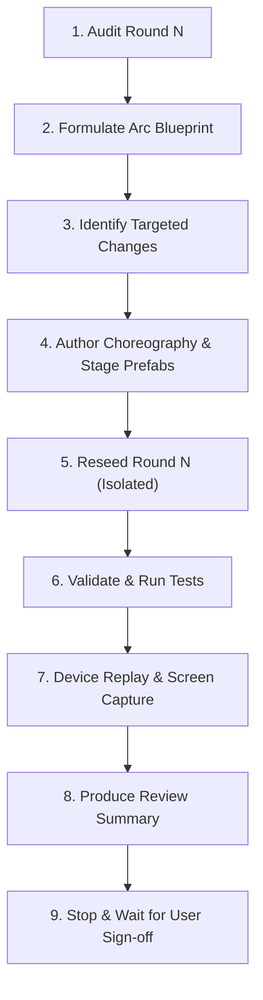

# Single-Round Escalation Workflow & Standard Operating Procedure

This document defines the repeatable, rigorous workflow for upgrading escalation across rounds (R3–R12) in **Save Peps**.

---

## 1. The Escalation Progression Architecture

Every round is a **3-rescue miniature adventure** obeying this strict hierarchy:

| Stage | Role | Duration Band | Step & Target Complexity | Visual & Choreography Weight |
|---|---|---|---|---|
| **Rescue 1** | **INTRODUCE** | **2.0 – 2.4s** | 3–8 steps, 2–4 movers | Simplest, direct expression of the world rule. Restrained camera, minimal moving parts. Quick payoff. |
| **Rescue 2** | **EXPAND** | **2.6 – 3.0s** | 9–20 steps, 5–9 movers | Multi-step reaction / system. Deeper mechanical or physical cause → effect chain. More reacting scene elements. |
| **Rescue 3** | **CLIMAX** | **3.2 – 3.6s** | 20–35+ steps, 8–12+ movers | Unmistakable climax. Full environment participation / transformation. Strongest choreography, sound, and payoff. |

---

## 2. The 9-Step Repeatable Workflow

When asked to improve a single round (e.g. *"Improve Round 3 escalation"*):



### Step 1: Automated & Qualitative Audit
Run the automated audit tool:
```bash
./scripts/escalate_round.py audit <round_num>
```
Inspect current step counts, durations, mover lists, and identify where the progression is flat.

### Step 2: Formulate Arc Blueprint
Plan the specific thematic progression for Round N:
- **R{N}.1 (Introduce):** Direct obstacle & concise single-cause solution.
- **R{N}.2 (Expand):** Multi-part system or helper reaction.
- **R{N}.3 (Climax):** Full diorama event / transformation unique to this world.

### Step 3: Identify Minimum Targeted Changes
- What diorama anchors/movers need to be added to the environment prefab in `DioramaLibrary.cs`?
- What choreography steps in `Round{N}Rescues.cs` need to be rewritten?
- Which reusable helpers from `EscalationAuthoring` (`Cascade`, `Shudder`, `Combine`, `Offset`) can be leveraged?

### Step 4: Author Choreography & Diorama Additions
Edit ONLY:
1. `unity/SavePeps/Assets/_Project/Code/Editor/Round{N}Rescues.cs`
2. Environment definitions for Round N in `DioramaLibrary.cs` (if additional movers are needed).

*Never touch other rounds' code or assets during this step.*

### Step 5: Isolated Reseeding
Reseed ONLY Round N to update the asset definitions:
```bash
./scripts/escalate_round.py reseed <round_num>
```

### Step 6: Automated Validation
Run content validation and EditMode tests:
```bash
./scripts/escalate_round.py validate <round_num>
```
Ensure 0 errors and all tests pass.

### Step 7: Device Replay & Verification
Prepare and launch Round N on the reference Pixel 4:
```bash
./scripts/escalate_round.py device-test <round_num>
```
Verify:
1. All 3 correct answers execute smoothly on hardware.
2. The climax runs without hitching or visual regressions.
3. Screenshots of all 3 stages/outcomes are captured into artifacts.

### Step 8: Standardized Review Summary
Create the round escalation artifact in `<conversation_dir>/round_{N}_escalation.md` with the standardized format (see below).

### Step 9: Stop for Human Sign-off
Present the review summary with before/after comparison and screenshots, and wait for approval before moving to the next round.

---

## 3. Standard Review Summary Template

Every round handoff MUST include:

```markdown
### Round {N} Escalation Report ({World Name})

#### 1. Escalation Arc Blueprint
- **R{N}.1 INTRODUCE ({Verb}):** [Brief description of the restrained direct obstacle]
- **R{N}.2 EXPAND ({Verb}):** [Brief description of the multi-step system reaction]
- **R{N}.3 CLIMAX ({Verb}):** [Brief description of the full environment climax]

#### 2. Quantitative Progression Metrics
| Metric | R{N}.1 (Introduce) | R{N}.2 (Expand) | R{N}.3 (Climax) |
|---|---|---|---|
| Duration | X.Xs | Y.Ys | Z.Zs |
| Steps in Correct Outcome | N1 | N2 | N3 |
| Unique Mover Targets | M1 | M2 | M3 |

#### 3. Verification & Device Proof
- **EditMode Test Suite:** total=47, passed=47, failed=0
- **Device Logcat:** Tapped answer confirmation on Pixel 4
- **Visual Artifacts:** [round_{N}_escalation.md](...)
```
